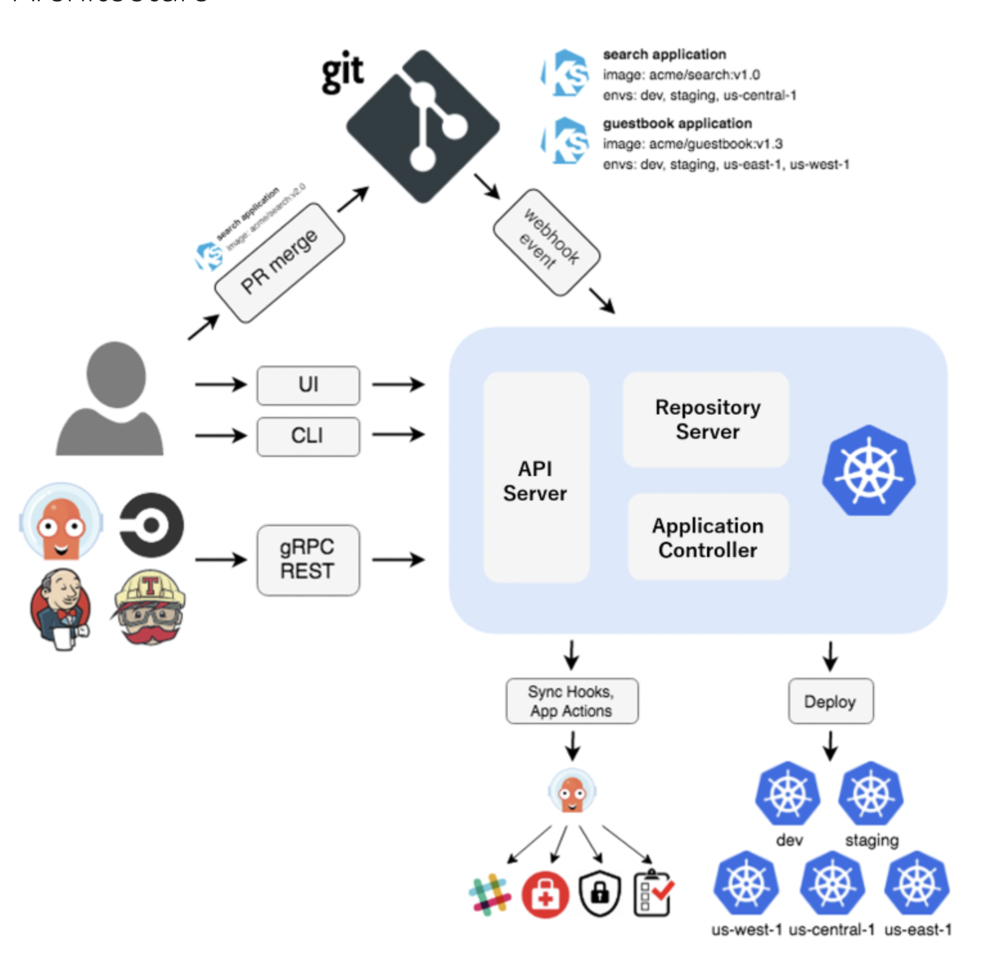
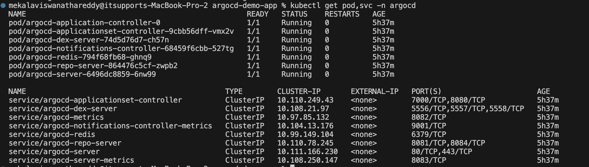
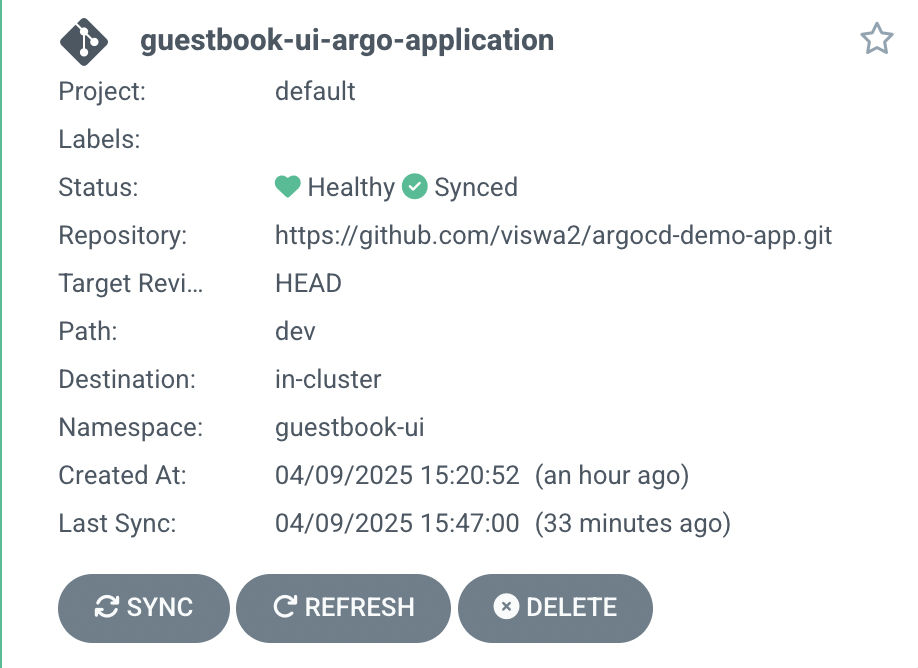
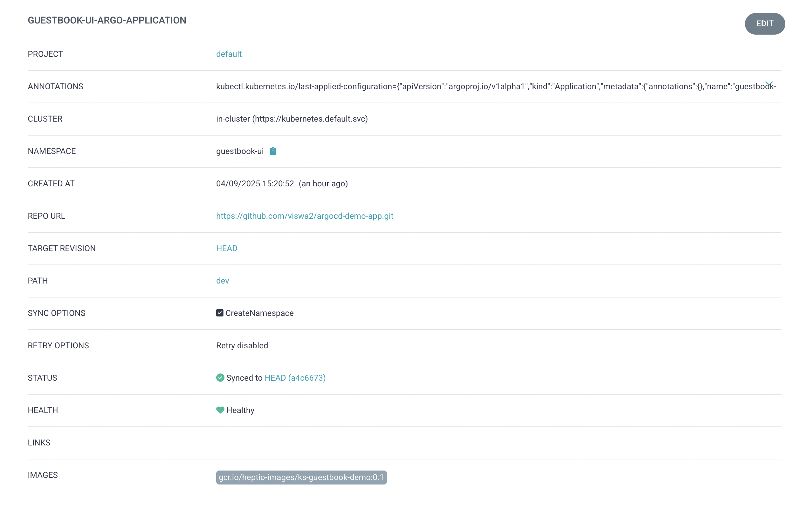

## Argocd-demo-app ##

`What Is Argo CD?`

Argo CD is a declarative, GitOps continuous delivery tool for Kubernetes.

`Why Argo CD?`

Application definitions, configurations, and environments should be declarative and version controlled. Application deployment and lifecycle management should be automated, auditable, and easy to understand.

`Benefits of Argo CD`

1. whole k8s configuration defined in code git repo.

2. config files are not applied manually from from local laptops.

3. git remains a single source of truth i.e if some one changes in the cluster for the manifest files, argocd detects manual changes it will overwrite those with respect git configurations only.

4. Easy rollback by using `git revert` the previous verssions

5. cluster disaster recovery

`How it works?`

Argo CD follows the GitOps pattern of using Git repositories as the source of truth for defining the desired application state. Kubernetes manifests can be specified in several ways:

✅ kustomize applications

✅ helm charts

✅ jsonnet files

✅ Plain directory of YAML/json manifests

✅ Any custom config management tool configured as a config management plugin

Argo CD automates the deployment of the desired application states in the specified target environments. Application deployments can track updates to branches, tags, or be pinned to a specific version of manifests at a Git commit

`Architecture:`

`Reference Link:` https://argo-cd.readthedocs.io/en/stable/

## prerequesites ##

1. Install kubernetes cluster in your local system i.e Minikube, Kind or EKS in AWS etc.

2. Installed Minikube in my local system which requires docker driver, so before installing minkube install docker in your respective `systems or OS`.

`Reference Link for minikube install`: https://minikube.sigs.k8s.io/docs/start/?arch=%2Fmacos%2Farm64%2Fstable%2Fbinary+download

3. After installing start the command called `minikube start` it will start the minikube cluster

4. check status `minikube status`

5. brew install argocd --> It will download the argocd cli

## Getting Started with Handson ##

1. Deploy argoCD in k8s cluster

2. Configure argocd with k8s manifest files

3. Test our setup by updating deployment.yaml files

## Deploy ArgoCD in K8s Cluster ##

1. kubectl create ns argocd

2. kubectl apply -n argocd -f https://raw.githubusercontent.com/argoproj/argo-cd/stable/manifests/install.yaml —> Install all manifests for argocd requirements

3. kubectl port-forward svc/argocd-server 8080:443 -n argocd  —> We need to login the argocd ui we are doing port forward

4. kubectl get pod, svc -n argocd

5. `https://localhost:8080/` —> login the ui, the default username is `admin`

6. kubectl get secret argocd-initial-admin-secret -n argocd -o yaml —> we can get the password here

7. echo <password> | base64 —decoded —> login by using decoded password

`Reference Link to install necessary configurations`: https://argo-cd.readthedocs.io/en/stable/getting_started/

## Configure Argocd With K8s Manifest Files ##

1. Create a git repository —> Ex: Argo CD app config

2. Add or push the application manifest files along with the application.yaml file

3. Create `application.yaml` file and specify the source and destination paths, automate sync options, automatic self heal options etc.

4. Once ready push the configurations files into git repo.

5. For the first fime you need to apply manually `kubectl apply -f application.yaml` in the kubernetes cluster

6. Check the synced project in argocd UI.

## Test Our Setup by Updating Deployment.yaml File ##

1. `Automate Sync Test`

To test with the automate sync in the git repo deployment.yaml file changed the image version from 0.2 to 0.1 and commit the change. as soon as change detected in the git repo argocd detects it. deployed newer version.

2. `Pruning Test`

If i want delete something in the configuration of yaml files or yaml file itself argocd detects it needs to remove automatically.

3. `Manual Chnages in the kubernetes cluster`

Tried to edit the deployment of guestbook with the no.of replicas 2 to 4, but argrocd undos manual changes, since we have enabled the automated self heal feature in `deployment.yaml file`

`Note: `ArgoCD polls git repository every 3 minutes, if you want to avoid that, as soon as chnages pushes into git repo it will syncronize we can acheive by using webhook configuration.

In the `ArgoCD UI` click on applications --> application name i.e guestbook-ui-argo-application and we can check the Events, logs, live manifest and desired manifests etc.

## Working With Multiple Cluster Nodes ##

Configure and manage just 1 argocd, same argocd instance is able to sync fleet of k8s cluster.

## Working With Multiple Cluster Environments ##

Each environment we need deploy argocd and test the application. We can test `DEV environment` first and move with the higher environments. i.e (DEV, TEST, PRE-PROD, PROD)